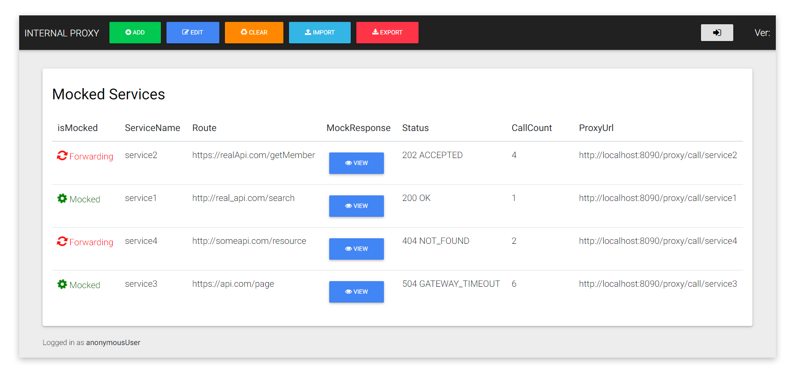

# Internal Proxy Mock Server
> This proxy server would significantly accelerate the development and implementation of new features related to internal/external API's that are either not ready or unavailable.
>  Internal Proxy would also help simulate the behavior of API calls in order to test various scenarios and conditions without having to re-deploy the app.
> The server can be deployed to cloud or ran locally where it will either be responding with mocked responses or forwarding calls to the real API route.

# Features

 - Forwarding or Mocking GET/POST Requests
 - HTTP Status Mocking
 - Importing and Exporting Profiles

# Building

To build use `:bootRun` gradle task. Building with InteliJ IDEA will not run the buildInfo task so versioning will not work, but the app would run fine.

# Contributions

Pull requests are very welcome! Please make sure to read the [contributing to the project](https://github.com/tabilzad/internal-proxy/wiki/) guide first. 
Then head over to the [open issues](https://github.com/tabilzad/internal-proxy/issues?state=open) to see if you can help fix any issues.
Make sure you let me know if you intend to work on something. Also, check out the [milestones](https://github.com/) to see what is planned for future releases.

# License

This project is licensed under the MIT License - see the [LICENSE](LICENSE) file for details